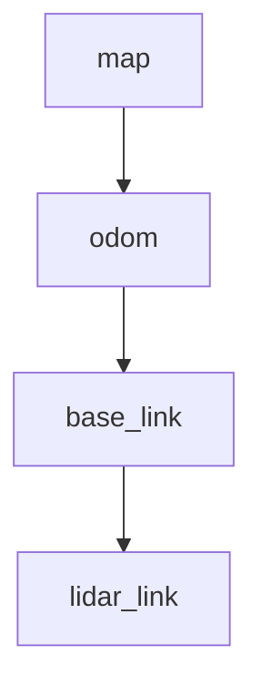
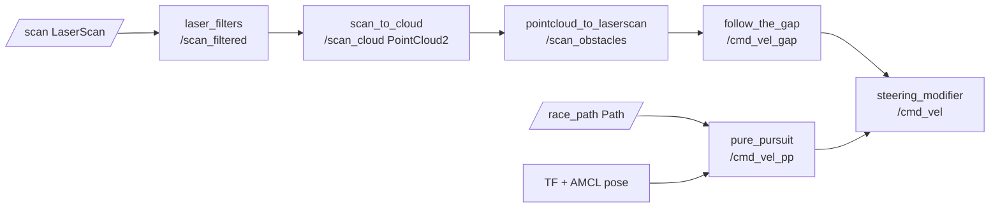

# TG30 5° Course Mapping, Rosbag Waypointing, and Racing Stack on ROS1 for ROSMASTER R2

## Executive summary

This is a **separate, isolated ROS1 catkin workspace** design for a ROSMASTER R2 (assumed differential drive) using a TG30 mounted **0.10–0.13 m above ground** pitched down **5°** to (1) map a driveway/sidewalk “race course,” (2) record high-quality rosbags while driving, (3) extract and publish waypoints, (4) build a lightweight “waypoint map” for visualization and progress-tracking, (5) localize against a saved 2D occupancy map (recommended: AMCL), and (6) run a “racing” controller with **pure pursuit + follow-the-gap** obstacle avoidance.

Key technical anchors from primary sources:

- TG30 has a factory/default motor frequency of **7 Hz** (typical) with angular resolution **0.13° at 7 Hz** (0.09° @ 5 Hz, 0.22° @ 12 Hz) and ToF ranging frequency **20 kHz**. citeturn0search0turn0search8  
- The official ROS driver repo documents that **TG30 uses 512000 baud** and provides a TG launch example and parameter names (`port`, `baudrate`, `lidar_type`, `frequency`, etc.). citeturn0search9turn7view0  
- `laser_filters` supports `scan_to_scan_filter_chain` for LaserScan filter chains. citeturn0search2turn0search6  
- `laser_geometry` provides LaserScan→PointCloud2 projection and explicitly notes suitability for tilting scanners (and includes a Python `LaserProjection` implementation for `projectLaser`). citeturn0search7turn12view1turn12view2  
- `octomap_server` incrementally builds an OctoMap from `PointCloud2` (`cloud_in`) with parameters (resolution, ground filtering, ROI passthrough limits, etc.). citeturn1search0turn1search1  
- `pointcloud_to_laserscan` converts PointCloud2 to LaserScan for 2D SLAM/localization. citeturn1search2  
- `slam_gmapping` builds a 2D occupancy map from LaserScan + odometry and can be saved with `map_server map_saver`. citeturn1search11turn1search3  
- `amcl` localizes with a particle filter using a known map + laser scans + TF. citeturn4search0  
- Pure Pursuit is commonly implemented as a geometric path tracker with a lookahead point; Coulter’s report is the canonical implementation reference. citeturn2search0  
- Follow-the-gap is a standard reactive obstacle avoidance approach used in autonomous racing curricula (F1TENTH). citeturn2search17turn2search6  
- Jetson Orin Nano class compute is sufficient for this TG30-at-7Hz pipeline; published specs include a 6‑core Cortex‑A78AE CPU and 1024 CUDA cores / 32 tensor cores on the Orin Nano Super developer kit page. citeturn2search3turn2search18  

(Where you did not specify details—robot max speed, exact wheelbase, odom quality, IMU presence, joystick model—I keep them as assumptions and parameterize all scripts.)

## Workspace isolation and layout

### New workspace path and “do not interfere” approach

Create a dedicated workspace (distinct from any existing `~/catkin_ws`):

- Workspace root: `~/ws_r2_tg30_race/`
- Use an **install space** (`catkin_make install`) and source **only in that terminal** (don’t append to `.bashrc`).

```bash
# 1) New workspace (distinct)
mkdir -p ~/ws_r2_tg30_race/src
cd ~/ws_r2_tg30_race

# 2) Source base ROS first (ROS1)
source /opt/ros/$ROS_DISTRO/setup.bash

# 3) Initialize + build + install
catkin_make -DCMAKE_BUILD_TYPE=Release
catkin_make install

# 4) Use this workspace in *this* terminal only
source ~/ws_r2_tg30_race/install/setup.bash

# 5) Confirm overlay order
echo $ROS_PACKAGE_PATH
```

This “install overlay” pattern is the simplest way to keep the workspace isolated and avoid accidental cross-workspace builds. (Catkin install overlays are standard ROS practice.)

### Dependencies to install (ROS1 apt packages)

Install the runtime dependencies you’ll use in launch files:

```bash
sudo apt-get update
sudo apt-get install -y \
  ros-$ROS_DISTRO-laser-filters \
  ros-$ROS_DISTRO-laser-geometry \
  ros-$ROS_DISTRO-pointcloud-to-laserscan \
  ros-$ROS_DISTRO-octomap-server \
  ros-$ROS_DISTRO-gmapping \
  ros-$ROS_DISTRO-amcl \
  ros-$ROS_DISTRO-map-server \
  ros-$ROS_DISTRO-tf \
  ros-$ROS_DISTRO-tf2-ros \
  ros-$ROS_DISTRO-robot-state-publisher \
  ros-$ROS_DISTRO-rviz
```

The above packages correspond to the mapped roles documented for `laser_filters`, `laser_geometry`, `pointcloud_to_laserscan`, `octomap_server`, `slam_gmapping`, and `amcl`. citeturn0search2turn12view1turn1search2turn1search0turn1search11turn4search0  

### Add TG30 driver source (official repo) into this workspace

The TG30 driver recommended here is the official `ydlidar_ros_driver`, which documents TG30 support, TG.launch defaults, and parameter names. citeturn6view0turn7view0turn0search9  

```bash
cd ~/ws_r2_tg30_race/src
git clone https://github.com/YDLIDAR/ydlidar_ros_driver.git

# Optional: follow repo instructions for YDLidar-SDK if needed by your setup.
# Then rebuild:
cd ~/ws_r2_tg30_race
catkin_make -DCMAKE_BUILD_TYPE=Release
catkin_make install
source ~/ws_r2_tg30_race/install/setup.bash
```

## Catkin package skeleton and node interfaces

### Packages in this workspace (minimal but complete)

You will create **one** new package to keep it simple:

- `r2_tg30_race` (your bringup, tools, and racing nodes)
- plus vendor driver package: `ydlidar_ros_driver` (cloned)

### File and folder manifest

Create this structure under `~/ws_r2_tg30_race/src/r2_tg30_race/`:

```text
r2_tg30_race/
  CMakeLists.txt
  package.xml
  launch/
    tg30_bringup_5deg.launch
    tg30_octomap_mapping.launch
    tg30_gmapping_mapping.launch
    tg30_amcl_localize.launch
    tg30_racing_live.launch
    tg30_replay_racing.launch
  config/
    scan_filters.yaml
    octomap.yaml
    pointcloud_to_laserscan.yaml
    pure_pursuit.yaml
    follow_the_gap.yaml
    cmd_arbiter.yaml
  urdf/
    tg30_mount.urdf.xacro
  scripts/
    scan_to_cloud.py
    bag_control_recorder.py
    waypoint_extractor.py
    waypoint_map_builder.py
    pure_pursuit_twist.py
    follow_the_gap.py
    steering_modifier.py
  rviz/
    tg30_map_and_path.rviz   (optional; can be created later)
  README.md
```

### Node list with topics, message types, and parameters

Below is the “contract” for each node so you can wire them together cleanly.

| Node | Purpose | Subscribes | Publishes | Key params |
|---|---|---|---|---|
| `scan_to_cloud.py` | LaserScan→PointCloud2 (tilted scan plane) using `laser_geometry` projection | `/scan_filtered` (`sensor_msgs/LaserScan`) | `/scan_cloud` (`sensor_msgs/PointCloud2`) | `~scan_topic`, `~cloud_topic` |
| `bag_control_recorder.py` | Start/stop rosbag recording with metadata | service `~set_recording` (`std_srvs/SetBool`), optional `/waypoint_mark` (`std_msgs/Empty`) | `/recording` (`std_msgs/Bool`), `/recording/bag_name` (`std_msgs/String`) | `~bag_dir`, `~topics`, `~course_name`, `~run_id`, `~target_speed_mps` |
| `waypoint_extractor.py` | Offline: extract waypoints from bag (A: spacing / B: manual marks) | bagfile via CLI (reads `/odom`, optional `/waypoint_mark`) | writes YAML, optional Path bag | `--spacing_m`, `--mode auto|manual`, `--odom_topic` |
| `waypoint_map_builder.py` | Publish `nav_msgs/Path` + markers from waypoint YAML | YAML file via param/CLI | `/race_path` (`nav_msgs/Path`), `/race_waypoints` (`visualization_msgs/MarkerArray`) | `~frame_id`, `~yaml_path`, `~publish_rate_hz` |
| `pure_pursuit_twist.py` | Pure pursuit tracker → `/cmd_vel_pp` | `/race_path` (`nav_msgs/Path`), `tf` map→base_link (preferred), fallback `/odom` | `/cmd_vel_pp` (`geometry_msgs/Twist`), `/pure_pursuit/lookahead_point` (`geometry_msgs/PointStamped`) | `~lookahead_k`, `~lookahead_min`, `~v_max`, `~w_max`, `~frame_id` |
| `follow_the_gap.py` | Reactive obstacle avoidance → `/cmd_vel_gap` | `/scan_obstacles` (`sensor_msgs/LaserScan`) | `/cmd_vel_gap` (`geometry_msgs/Twist`) | `~range_max`, `~bubble_radius_m`, `~gap_min_width_deg`, `~v_max`, `~w_max` |
| `steering_modifier.py` | Arbitration + safety: combine pure pursuit + gap | `/cmd_vel_pp`, `/cmd_vel_gap`, `/scan_obstacles` | `/cmd_vel` (`geometry_msgs/Twist`) | `~safety_stop_range_m`, `~pp_priority`, `~v_limit_mps` |

Notes:
- `laser_filters` and `scan_to_scan_filter_chain` are used to produce `/scan_filtered`. citeturn0search2turn0search6  
- Python `laser_geometry` provides `LaserProjection.projectLaser()` → PointCloud2 in the scan frame (we then publish that). citeturn12view1turn12view2  
- `octomap_server` expects `PointCloud2` on `cloud_in` and has ROI passthrough and ground filtering parameters. citeturn1search0turn1search1  

### package.xml (minimal)

```xml
<?xml version="1.0"?>
<package format="2">
  <name>r2_tg30_race</name>
  <version>0.1.0</version>
  <description>TG30 5deg course mapping + waypoint extraction + racing stack (ROS1)</description>

  <maintainer email="you@example.com">you</maintainer>
  <license>BSD</license>

  <buildtool_depend>catkin</buildtool_depend>

  <exec_depend>rospy</exec_depend>
  <exec_depend>sensor_msgs</exec_depend>
  <exec_depend>nav_msgs</exec_depend>
  <exec_depend>geometry_msgs</exec_depend>
  <exec_depend>std_msgs</exec_depend>
  <exec_depend>std_srvs</exec_depend>
  <exec_depend>visualization_msgs</exec_depend>

  <exec_depend>tf</exec_depend>
  <exec_depend>tf2_ros</exec_depend>

  <!-- runtime tools -->
  <exec_depend>laser_filters</exec_depend>
  <exec_depend>laser_geometry</exec_depend>
  <exec_depend>pointcloud_to_laserscan</exec_depend>
  <exec_depend>octomap_server</exec_depend>
  <exec_depend>gmapping</exec_depend>
  <exec_depend>amcl</exec_depend>
  <exec_depend>map_server</exec_depend>

  <export/>
</package>
```

### CMakeLists.txt (Python-only)

```cmake
cmake_minimum_required(VERSION 3.0.2)
project(r2_tg30_race)

find_package(catkin REQUIRED)

catkin_package()

catkin_install_python(PROGRAMS
  scripts/scan_to_cloud.py
  scripts/bag_control_recorder.py
  scripts/waypoint_extractor.py
  scripts/waypoint_map_builder.py
  scripts/pure_pursuit_twist.py
  scripts/follow_the_gap.py
  scripts/steering_modifier.py
  DESTINATION ${CATKIN_PACKAGE_BIN_DESTINATION}
)

install(DIRECTORY launch config urdf rviz
  DESTINATION ${CATKIN_PACKAGE_SHARE_DESTINATION}
)
```

## Hardware geometry and TF extrinsics

### Ground-intersection distance for 5° tilt at 0.10–0.13 m height

For a LiDAR at height \(h\) above flat ground pitched down by \(\theta\), the scan plane intersects the ground at approximate forward distance:

\[
d = \frac{h}{\tan(\theta)}
\]

At \(\theta = 5^\circ\), \(\tan(5^\circ)\approx 0.08749\), so \(d \approx 11.43h\):

- \(h = 0.10\) m → \(d \approx 1.14\) m  
- \(h = 0.1143\) m (4.5 in) → \(d \approx 1.31\) m  
- \(h = 0.13\) m → \(d \approx 1.49\) m  

This “lookahead curtain” is a major design constraint for racing speed: if you need longer lookahead, you either raise the sensor, reduce pitch, or fuse another sensor. TG30’s typical motor frequency of **7 Hz** (factory setting) and angular resolution **0.13° at 7 Hz** defines the basic measurement density you’ll have within that lookahead region. citeturn0search0turn0search8  

### Recommended TF for `base_link → lidar_link`

Assumptions you provided:
- Height: 0.1143 m
- Forward offset: 0.20 m (editable param)
- Pitch: −5° = −0.087266 rad
- `y=0`

#### URDF fixed joint snippet

```xml
<joint name="base_to_lidar" type="fixed">
  <parent link="base_link"/>
  <child link="lidar_link"/>
  <origin xyz="0.20 0.00 0.1143" rpy="0.0 -0.087266 0.0"/>
</joint>
```

Publish with `robot_state_publisher` if you already have a robot model. citeturn3search2turn3search6  

#### ROS1 `static_transform_publisher` launch example

ROS1 `tf`’s `static_transform_publisher` uses **x y z yaw pitch roll** ordering (yaw about Z, pitch about Y, roll about X) plus a period. citeturn3search7turn3search11turn3search38  

```xml
<launch>
  <node pkg="tf" type="static_transform_publisher" name="base_to_lidar_tf"
        args="0.20 0 0.1143 0 -0.087266 0 base_link lidar_link 100"/>
</launch>
```

## Data collection workflow and waypoint extraction

### Driving + bagging workflow (recommended procedure)

Goal: produce **replayable** bags that can regenerate maps and waypoints.

1) Bring up TG30 + TF + filtering and visualize in RViz:
   - Confirm `/scan`, `/scan_filtered`, TF tree, and that scan points align with curb/edges.
   - `laser_filters` makes `/scan_filtered` with a configured chain. citeturn0search2turn0search6  

2) Start recording (via service) before moving; drive 2–3 laps at **slow speed first** (≤0.5 m/s).

3) Record these topics (minimum):
   - `/scan` (raw)
   - `/scan_filtered`
   - `/tf` (and `/tf_static` if present)
   - `/odom`
   - `/cmd_vel` (optional but useful for dataset labeling)
   - `/joy` or joystick topic if you use joystick
   - `/imu` if present (optional)

Rosbag’s CLI supports recording, splitting, compressing, and is documented in ROS wiki reference pages. citeturn3search0turn3search20turn3search28  

### Bag naming and metadata convention

Recommended folder layout inside the workspace:

- `~/ws_r2_tg30_race/bags/<course_name>/`
- Bag name format:
  - `<course>_<YYYYMMDD_HHMMSS>_run<id>_v<speed>.bag`
- Metadata YAML alongside:
  - same prefix, `.meta.yaml` suffix
  - include: course name, run id, speed estimate, operator, notes, git commit hash of your workspace, and TF parameters version.

### Sample rosbag record command (fallback / manual)

```bash
mkdir -p ~/ws_r2_tg30_race/bags/driveway_course
cd ~/ws_r2_tg30_race/bags/driveway_course

rosbag record --lz4 -O driveway_course_$(date +%Y%m%d_%H%M%S)_run01_v0p8 \
  /scan /scan_filtered /tf /odom /cmd_vel /joy
```

Rosbag’s `--split` and `--duration` options exist if you want fixed-duration chunks. citeturn3search0  

### Recorder node: start/stop via service (Python, minimal)

Create `scripts/bag_control_recorder.py`:

```python
#!/usr/bin/env python3
import os
import signal
import subprocess
import time
import yaml

import rospy
from std_msgs.msg import Bool, String
from std_srvs.srv import SetBool, SetBoolResponse

class BagControlRecorder:
    def __init__(self):
        self.bag_dir = rospy.get_param("~bag_dir", os.path.expanduser("~/ws_r2_tg30_race/bags"))
        self.course_name = rospy.get_param("~course_name", "course")
        self.run_id = rospy.get_param("~run_id", "run01")
        self.target_speed_mps = float(rospy.get_param("~target_speed_mps", 0.5))
        self.topics = rospy.get_param("~topics", ["/scan", "/scan_filtered", "/tf", "/odom"])
        self.use_lz4 = bool(rospy.get_param("~lz4", True))

        self.proc = None
        self.current_bag = ""

        os.makedirs(os.path.join(self.bag_dir, self.course_name), exist_ok=True)

        self.pub_recording = rospy.Publisher("/recording", Bool, queue_size=1, latch=True)
        self.pub_bagname = rospy.Publisher("/recording/bag_name", String, queue_size=1, latch=True)

        self.srv = rospy.Service("~set_recording", SetBool, self.handle_set_recording)
        self.set_recording(False)

    def set_recording(self, enabled: bool):
        self.pub_recording.publish(Bool(data=enabled))
        self.pub_bagname.publish(String(data=self.current_bag or ""))

    def handle_set_recording(self, req: SetBool.Request):
        if req.data:
            ok, msg = self.start()
        else:
            ok, msg = self.stop()
        return SetBoolResponse(success=ok, message=msg)

    def start(self):
        if self.proc is not None:
            return False, "Already recording."

        stamp = time.strftime("%Y%m%d_%H%M%S")
        bag_base = f"{self.course_name}_{stamp}_{self.run_id}_v{self.target_speed_mps:.2f}".replace(".", "p")
        bag_path = os.path.join(self.bag_dir, self.course_name, bag_base + ".bag")
        meta_path = os.path.join(self.bag_dir, self.course_name, bag_base + ".meta.yaml")

        meta = {
            "course_name": self.course_name,
            "run_id": self.run_id,
            "target_speed_mps": self.target_speed_mps,
            "topics": self.topics,
            "started_walltime": stamp,
        }
        with open(meta_path, "w") as f:
            yaml.safe_dump(meta, f)

        cmd = ["rosbag", "record", "-O", bag_path]
        if self.use_lz4:
            cmd.insert(2, "--lz4")
        cmd.extend(self.topics)

        rospy.loginfo("Starting rosbag: %s", " ".join(cmd))
        self.proc = subprocess.Popen(cmd, preexec_fn=os.setsid)
        self.current_bag = bag_path
        self.set_recording(True)
        return True, f"Recording {bag_path}"

    def stop(self):
        if self.proc is None:
            return False, "Not recording."

        rospy.loginfo("Stopping rosbag...")
        try:
            os.killpg(os.getpgid(self.proc.pid), signal.SIGINT)
            self.proc.wait(timeout=10.0)
        except Exception as e:
            rospy.logwarn("Graceful stop failed (%s). Killing.", e)
            try:
                os.killpg(os.getpgid(self.proc.pid), signal.SIGKILL)
            except Exception:
                pass

        bag_path = self.current_bag
        self.proc = None
        self.current_bag = ""
        self.set_recording(False)
        return True, f"Stopped. Last bag: {bag_path}"

if __name__ == "__main__":
    rospy.init_node("bag_control_recorder")
    BagControlRecorder()
    rospy.spin()
```

Rosbag “command line” and Python API are both documented; this node leverages the CLI for reliability and writes metadata alongside. citeturn3search0turn3search1turn3search28  

### Waypoint extraction from bag(s): two supported modes

You’ll produce:
- `waypoints.yaml`
- optional `race_path.bag` that contains a `nav_msgs/Path` on `/race_path` for RViz replay.

**Option A (automated):** sample by distance along `/odom` position.  
**Option B (manual):** during driving, publish `/waypoint_mark` (`std_msgs/Empty`) from a joystick button; when processing the bag, take the nearest `/odom` pose at each mark.

Rosbag Python API supports reading messages by topic and writing new topics to a new bag. citeturn3search1turn3search9  

Create `scripts/waypoint_extractor.py`:

```python
#!/usr/bin/env python3
import argparse
import math
import os
import yaml

import rosbag
import rospy
from nav_msgs.msg import Path, Odometry
from geometry_msgs.msg import PoseStamped
from std_msgs.msg import Empty

def yaw_from_quat(q):
    # yaw from quaternion (z-axis)
    siny_cosp = 2.0 * (q.w * q.z + q.x * q.y)
    cosy_cosp = 1.0 - 2.0 * (q.y * q.y + q.z * q.z)
    return math.atan2(siny_cosp, cosy_cosp)

def dist2(p1, p2):
    dx = p1[0] - p2[0]
    dy = p1[1] - p2[1]
    return dx*dx + dy*dy

def main():
    ap = argparse.ArgumentParser()
    ap.add_argument("--bag", required=True)
    ap.add_argument("--odom_topic", default="/odom")
    ap.add_argument("--mark_topic", default="/waypoint_mark")
    ap.add_argument("--mode", choices=["auto", "manual"], default="auto")
    ap.add_argument("--spacing_m", type=float, default=0.50)
    ap.add_argument("--frame_id", default="map")  # visualization frame; may be odom if you don't have map
    ap.add_argument("--out_yaml", default="waypoints.yaml")
    ap.add_argument("--out_path_bag", default="race_path.bag")
    args = ap.parse_args()

    bag = rosbag.Bag(args.bag, "r")

    # Load odom into a time-indexed list
    odom_msgs = []
    for topic, msg, t in bag.read_messages(topics=[args.odom_topic]):
        if isinstance(msg, Odometry):
            p = msg.pose.pose.position
            q = msg.pose.pose.orientation
            odom_msgs.append((t.to_sec(), (p.x, p.y, yaw_from_quat(q))))
    if not odom_msgs:
        raise RuntimeError(f"No odom messages on {args.odom_topic}")

    # Helper: nearest odom sample by time (linear scan is fine for small bags; optimize later if needed)
    def nearest_odom(ts):
        best = None
        best_dt = 1e9
        for tsec, pose in odom_msgs:
            dt = abs(tsec - ts)
            if dt < best_dt:
                best_dt, best = dt, pose
        return best

    waypoints = []

    if args.mode == "manual":
        mark_times = []
        for topic, msg, t in bag.read_messages(topics=[args.mark_topic]):
            if isinstance(msg, Empty):
                mark_times.append(t.to_sec())
        if not mark_times:
            raise RuntimeError(f"No waypoint marks on {args.mark_topic}")
        for ts in mark_times:
            x, y, yaw = nearest_odom(ts)
            waypoints.append({"x": float(x), "y": float(y), "yaw": float(yaw)})

    else:
        # auto: distance-based sampling
        last = None
        accum = 0.0
        for _, (x, y, yaw) in odom_msgs:
            if last is None:
                waypoints.append({"x": float(x), "y": float(y), "yaw": float(yaw)})
                last = (x, y)
                continue
            step = math.sqrt(dist2((x, y), last))
            accum += step
            if accum >= args.spacing_m:
                waypoints.append({"x": float(x), "y": float(y), "yaw": float(yaw)})
                accum = 0.0
                last = (x, y)

    # Write YAML
    with open(args.out_yaml, "w") as f:
        yaml.safe_dump({"frame_id": args.frame_id, "waypoints": waypoints}, f)

    # Write Path bag
    path = Path()
    path.header.frame_id = args.frame_id
    for i, wp in enumerate(waypoints):
        ps = PoseStamped()
        ps.header.frame_id = args.frame_id
        ps.header.seq = i
        ps.pose.position.x = wp["x"]
        ps.pose.position.y = wp["y"]
        # yaw -> quaternion (z-only)
        yaw = wp["yaw"]
        ps.pose.orientation.w = math.cos(yaw/2.0)
        ps.pose.orientation.z = math.sin(yaw/2.0)
        path.poses.append(ps)

    out_bag = rosbag.Bag(args.out_path_bag, "w")
    out_bag.write("/race_path", path, t=rospy.Time.from_sec(0.0))
    out_bag.close()

    print(f"Wrote {len(waypoints)} waypoints -> {args.out_yaml} and {args.out_path_bag}")

if __name__ == "__main__":
    main()
```

Waypoint spacing guidance (practical):

| Spacing (m) | Typical result | When to use |
|---:|---|---|
| 0.10–0.20 | Very tight tracking of curves; heavy waypoint count | Tight driveway turns, low drift, moderate CPU |
| 0.30–0.50 | Balanced | Most driveway/sidewalk courses |
| 0.75–1.00 | Sparse; smoother but cuts corners | Long straight segments, low curvature |

## Map building, waypoint map, and localization

You requested two map types from TG30.

### Option one: OctoMap mapping from tilted scan plane (3D-ish mapping)

Pipeline:
`/scan` → `laser_filters` → `/scan_filtered` → `scan_to_cloud` → `/scan_cloud` → `octomap_server`

OctoMap is an octree-based probabilistic 3D mapping framework; it models occupied/free/unknown space and is designed to be memory efficient in robotics contexts. citeturn1search1turn1search21  

`octomap_server` specifically supports incremental building from `PointCloud2 cloud_in` with ROI passthrough and optional ground filtering. citeturn1search0turn1search16turn1search1  

Recommended `octomap.yaml` (start values for a driveway):

```yaml
frame_id: odom
base_frame_id: base_link
resolution: 0.05

sensor_model:
  max_range: 12.0

filter_speckles: true
filter_ground: true
ground_filter:
  distance: 0.04
  angle: 0.15
  plane_distance: 0.07

# ROI: focus forward area; tune
pointcloud_min_x: 0.0
pointcloud_max_x: 6.0
pointcloud_min_y: -4.0
pointcloud_max_y: 4.0
pointcloud_min_z: -0.5
pointcloud_max_z: 1.0
```

Those parameter names match `octomap_server`’s documented interface and examples (including `ground_filter/distance|angle|plane_distance` and pointcloud min/max). citeturn1search0turn1search16turn1search1  

### Option two: 2D occupancy map via GMapping (recommended for AMCL)

Because the LiDAR is tilted, you typically want a “derived” LaserScan that represents obstacles (curb faces, walls) while suppressing ground-plane returns. The standard tool for this is PointCloud2→LaserScan using `pointcloud_to_laserscan`, which is explicitly designed to feed 2D algorithms like laser SLAM. citeturn1search2  

Pipeline:
`/scan_filtered` → `/scan_cloud` → `pointcloud_to_laserscan` → `/scan_obstacles` → `slam_gmapping`

`slam_gmapping` is a wrapper that reads LaserScan + odometry and computes a 2D occupancy grid map. citeturn1search11turn1search3  

Recommended `pointcloud_to_laserscan.yaml` (for curb/obstacle returns; tune these heights on your robot):

```yaml
target_frame: base_link
transform_tolerance: 0.05

min_height: 0.02
max_height: 0.40

angle_min: -3.14159
angle_max:  3.14159
angle_increment: 0.0058

scan_time: 0.143  # ~7Hz
range_min: 0.08
range_max: 12.0

use_inf: true
inf_epsilon: 1.0
```

### Building the map (online or offline)

**Online mapping run**:
1) Launch TG30 bringup + gmapping.
2) Drive the course at slow speed for best scan overlap.
3) Save map: `rosrun map_server map_saver -f driveway_map` (this usage is shown in gmapping docs). citeturn1search11turn1search3  

**Offline mapping from bag**:
1) `rosparam set use_sim_time true`
2) `rosbag play --clock <bagfile>`
3) Run gmapping and save.

Rosbag record/play usage, including tutorials for recording and playback, is documented in ROS wiki. citeturn3search20turn3search0  

### Localization against the map (AMCL recommended)

AMCL takes a laser-based map, laser scans, and TF, and outputs pose estimates (particle filter localization). citeturn4search0  

Use AMCL with:
- `map_server` publishing your saved map,
- `amcl` subscribing to `/scan_obstacles` (your derived scan) and TF.

If you have an IMU, fuse `/odom` + `/imu` with an EKF (`robot_localization`) for a more stable odom frame; robot_localization is explicitly meant for fusing continuous sensor data (wheel odometry, IMU, etc.). citeturn4search2turn4search26  

## Racing stack: pure pursuit + follow-the-gap integration

### Control architecture and TF expectations

Pure pursuit controllers generally assume a path (series of poses) and a real-time estimate of the vehicle pose; Coulter’s report gives the geometric derivation and implementation details for pure pursuit. citeturn2search0  

Follow-the-gap is a reactive method that chooses a steering direction based on the largest navigable gap in the scan; it’s a standard pattern in F1TENTH labs and multiple ROS implementations. citeturn2search17turn2search6  

#### TF tree you should have at runtime



AMCL typically provides `map→odom` while odometry provides `odom→base_link`; your static TF provides `base_link→lidar_link`. citeturn4search0turn3search7  

### Pure pursuit tuning for differential drive (actionable defaults)

Use lookahead based on speed:

- \(L = \max(L_{\min}, k\cdot v)\)
- Choose \(k = 0.5–1.0\ \text{s}\) (your spec) and \(L_{\min}\approx 0.3\ \text{m}\)

Safety constraints (recommended):
- Lateral acceleration limit: \(a_{\text{lat}} = v^2/R \le a_{\text{lat,max}}\) (set \(a_{\text{lat,max}}\) ≈ 0.8–1.5 m/s² for a small sidewalk robot unless you have rigorous braking/traction tests).
- Stopping distance constraint: ensure \(d_{\text{stop}} = v^2/(2a_{\text{brake}})\) is less than your effective sensing lookahead (for TG30 at 0.1143 m and 5°, the “curtain” is ~1.31 m ahead by the geometry section).

### Follow-the-gap tuning (actionable defaults)

Given your derived obstacle scan `/scan_obstacles`:
- `range_max`: 5–12 m (match course scale)
- “bubble” radius: 0.30–0.60 m
- minimum gap width: 10–25° (depends on robot width + margin)
- reduce speed when the chosen gap is narrow or the nearest obstacle is close

### Arbitration logic (simple and reliable)

- Pure pursuit generates nominal `/cmd_vel_pp`.
- Follow-the-gap generates `/cmd_vel_gap` (reactive).
- `steering_modifier`:
  - If min scan range < `safety_stop_range_m`: stop.
  - Else if min scan range < `avoid_range_m`: prefer gap steering and potentially reduce speed.
  - Else: pure pursuit has priority.

This makes obstacle avoidance a **local safety layer** rather than a global replanner, which is appropriate for “racing” on a fixed path.

### Processing pipeline diagram



`pointcloud_to_laserscan` is explicitly intended to convert a PointCloud2 to LaserScan for 2D algorithms (and you reuse it here for racing obstacle avoidance). citeturn1search2  

## Safety, replay, and real-time considerations

### Minimal working “bringup + mapping + recording” launch sequence

Your minimal working goal was: TG30 driver + static TF + filter chain + scan_to_cloud + octomap_server + recorder.

Create `launch/tg30_octomap_mapping.launch`:

```xml
<launch>
  <!-- TG30 driver (direct node, based on TG.launch parameter names) -->
  <node name="ydlidar_lidar_publisher" pkg="ydlidar_ros_driver" type="ydlidar_ros_driver_node" output="screen">
    <param name="port" value="/dev/ydlidar"/>
    <param name="frame_id" value="lidar_link"/>
    <param name="baudrate" value="512000"/>
    <param name="lidar_type" value="0"/>         <!-- TYPE_TOF -->
    <param name="device_type" value="0"/>        <!-- SERIAL -->
    <param name="sample_rate" value="20"/>
    <param name="resolution_fixed" value="true"/>
    <param name="auto_reconnect" value="true"/>
    <param name="reversion" value="true"/>
    <param name="inverted" value="true"/>
    <param name="angle_min" value="-180"/>
    <param name="angle_max" value="180"/>
    <param name="range_min" value="0.08"/>
    <param name="range_max" value="12.0"/>
    <param name="frequency" value="7.0"/>
  </node>

  <!-- Static TF: base_link -> lidar_link -->
  <node pkg="tf" type="static_transform_publisher" name="base_to_lidar_tf"
        args="0.20 0 0.1143 0 -0.087266 0 base_link lidar_link 100"/>

  <!-- LaserScan filter chain -->
  <node pkg="laser_filters" type="scan_to_scan_filter_chain" name="scan_filter">
    <remap from="scan" to="/scan"/>
    <remap from="scan_filtered" to="/scan_filtered"/>
    <rosparam command="load" file="$(find r2_tg30_race)/config/scan_filters.yaml"/>
  </node>

  <!-- scan_to_cloud -->
  <node pkg="r2_tg30_race" type="scan_to_cloud.py" name="scan_to_cloud">
    <param name="scan_topic" value="/scan_filtered"/>
    <param name="cloud_topic" value="/scan_cloud"/>
  </node>

  <!-- octomap_server -->
  <node pkg="octomap_server" type="octomap_server_node" name="octomap_server" output="screen">
    <remap from="cloud_in" to="/scan_cloud"/>
    <rosparam command="load" file="$(find r2_tg30_race)/config/octomap.yaml"/>
  </node>

  <!-- recorder -->
  <node pkg="r2_tg30_race" type="bag_control_recorder.py" name="bag_recorder" output="screen">
    <param name="bag_dir" value="$(env HOME)/ws_r2_tg30_race/bags"/>
    <param name="course_name" value="driveway_course"/>
    <param name="run_id" value="run01"/>
    <param name="target_speed_mps" value="0.5"/>
    <rosparam param="topics">[/scan, /scan_filtered, /scan_cloud, /tf, /odom, /cmd_vel]</rosparam>
  </node>
</launch>
```

This launch directly mirrors the official driver’s parameter names used in `TG.launch` and the driver README. citeturn7view0turn6view0turn0search9  
Static TF argument ordering is defined in ROS `tf` documentation. citeturn3search7turn3search38  
`laser_filters` node name and filter-chain mechanism are documented on ROS wiki/tutorial pages. citeturn0search2turn0search6  
`octomap_server` topic name `cloud_in` and incremental mapping role are documented in its ROS wiki and OctoMap references. citeturn1search0turn1search1  

### scan_filters.yaml (recommended starter chain for TG30 5°)

Create `config/scan_filters.yaml`:

```yaml
scan_filter_chain:
  - name: range
    type: laser_filters/LaserScanRangeFilter
    params:
      lower_threshold: 0.08
      upper_threshold: 12.0
      lower_replacement_value: 0.0
      upper_replacement_value: 0.0

  - name: crop_front
    type: laser_filters/LaserScanAngularBoundsFilter
    params:
      lower_angle: -2.3   # ~-132 deg
      upper_angle:  2.3   # ~+132 deg

  - name: speckle
    type: laser_filters/LaserScanSpeckleFilter
    params:
      filter_window: 2
      max_range: 12.0

  - name: median
    type: laser_filters/LaserScanMedianSpatialFilter
    params:
      window_size: 5
```

This is consistent with how `scan_to_scan_filter_chain` is intended to be used (ROS wiki). citeturn0search2turn0search6  

### scan_to_cloud.py (Python; uses laser_geometry’s LaserProjection)

Create `scripts/scan_to_cloud.py`:

```python
#!/usr/bin/env python3
import rospy
from sensor_msgs.msg import LaserScan, PointCloud2

# Python laser_geometry implementation (projectLaser)
import laser_geometry.laser_geometry as lg

class ScanToCloud:
    def __init__(self):
        self.scan_topic = rospy.get_param("~scan_topic", "/scan_filtered")
        self.cloud_topic = rospy.get_param("~cloud_topic", "/scan_cloud")

        self.proj = lg.LaserProjection()
        self.pub = rospy.Publisher(self.cloud_topic, PointCloud2, queue_size=5)
        rospy.Subscriber(self.scan_topic, LaserScan, self.cb, queue_size=5)

    def cb(self, scan: LaserScan):
        cloud = self.proj.projectLaser(scan)  # cloud in scan frame
        cloud.header.stamp = scan.header.stamp
        cloud.header.frame_id = scan.header.frame_id
        self.pub.publish(cloud)

if __name__ == "__main__":
    rospy.init_node("scan_to_cloud")
    ScanToCloud()
    rospy.spin()
```

The Python `LaserProjection` implementation and `projectLaser()` behavior are visible in the upstream `laser_geometry.py` file (it produces a PointCloud2 in the same frame as the scan). citeturn12view1turn12view2  

### Replay for racing (bags + /clock)

Replay a mapping bag:

```bash
rosparam set use_sim_time true
rosbag play --clock path/to/bagfile.bag
```

Rosbag playback with `--clock` and typical recording/playback patterns are documented in ROS tutorials/commandline reference. citeturn3search20turn3search0  

### Safety and testing checklist (high-value items only)

Pre-drive:
- Confirm TF tree: `base_link → lidar_link` has pitch −5° and correct translation; static publisher argument ordering is a common pitfall. citeturn3search7turn3search38  
- Confirm `/scan` frame id matches your TF child frame (`lidar_link`) (driver parameter `frame_id`). citeturn7view0  
- RViz: show `/scan`, `/scan_filtered`, `/scan_cloud`, OctoMap markers, and odom TF.  
- Verify your emergency stop behavior (hardware or software). If you use arbitration, ensure a “stop” source can override `/cmd_vel`.

Shakedown:
- Drive one lap at low speed; ensure:
  - no TF dropouts,
  - OctoMap updates are sensible (ground filter not misclassifying),
  - waypoint extractor outputs plausible spacing.

Fallback behaviors:
- If localization confidence drops (AMCL divergence), reduce speed and/or revert to “gap only” mode (reactive). AMCL’s role—map + scans + TF → pose—is explicit. citeturn4search0  

### Real-time considerations on Jetson Orin Nano (conservative estimates)

Your TG30 runs at ~7 Hz with ~0.13° angular resolution; this implies a few thousand points per scan, and the pipelines here are comparatively light. citeturn0search0turn0search8  
Jetson Orin Nano specs (6‑core Cortex‑A78AE, 1024 CUDA cores / 32 tensor cores, 8GB LPDDR5) indicate enough headroom for this stack. citeturn2search3turn2search18  

Conservative **CPU load estimates** (Orin Nano, 6 cores, ROS1 Python nodes; actual depends on map size and OctoMap resolution):

| Component | Rate | CPU estimate | Notes |
|---|---:|---:|---|
| TG30 driver node | 7 Hz | 2–6% | Serial + parsing; depends on logging level. citeturn6view0turn7view0 |
| laser_filters chain | 7 Hz | 1–3% | Linear in beams; usually cheap. citeturn0search2 |
| scan_to_cloud (Python projectLaser) | 7 Hz | 2–8% | Numpy-based projection; still modest. citeturn12view2 |
| octomap_server insertion | 7 Hz | 5–25% | Dominant cost; scales with ROI and resolution. citeturn1search0turn1search1 |
| pure pursuit | 20–50 Hz | <1% | Geometric tracking is lightweight. citeturn2search0 |
| follow-the-gap | 20–50 Hz | 1–5% | Lightweight scan processing; depends on smoothing and windowing. citeturn2search17 |

Optimization levers (impact order):
1) Tighten OctoMap ROI (`pointcloud_*_min/max`) and reduce the insertion rate if needed. citeturn1search0turn1search16  
2) Increase OctoMap resolution from 0.05 → 0.10 m if you only need coarse obstacle volumes. citeturn1search1  
3) If Python becomes the bottleneck, rewrite `follow_the_gap` and `pure_pursuit` in C++ (optional); keep bringup stable first.  
4) Reduce RViz usage on the robot during racing (use remote RViz if possible).

## Primary sources referenced

- TG30 datasheet and TG30 specs (7 Hz typical, angular resolution vs frequency). citeturn0search0turn0search8  
- ROS driver repo for TG30 + `TG.launch` parameter names and defaults (including 512000 baud and ToF type). citeturn6view0turn7view0turn0search9  
- `laser_filters` (`scan_to_scan_filter_chain`) node and tutorials. citeturn0search2turn0search6  
- `laser_geometry` package overview + Python `LaserProjection.projectLaser()` implementation. citeturn0search7turn12view1turn12view2  
- OctoMap papers and OctoMap framework references. citeturn1search1turn1search17turn1search21  
- `octomap_server` ROS node role and parameters. citeturn1search0turn1search16  
- `pointcloud_to_laserscan` purpose and role for feeding 2D SLAM. citeturn1search2  
- `slam_gmapping` docs and ROS wiki summary. citeturn1search11turn1search3  
- AMCL ROS wiki. citeturn4search0  
- Pure Pursuit canonical technical report (Coulter). citeturn2search0  
- Follow-the-gap references (F1TENTH lab + ROS implementation). citeturn2search17turn2search6  
- Rosbag CLI + Code API references. citeturn3search0turn3search1turn3search28  
- ROS1 `tf` static transform publisher argument ordering and semantics. citeturn3search7turn3search38  
- Jetson Orin Nano Super dev kit specs and Orin Nano datasheet bandwidth figures (for feasibility framing). citeturn2search3turn2search18turn2search22